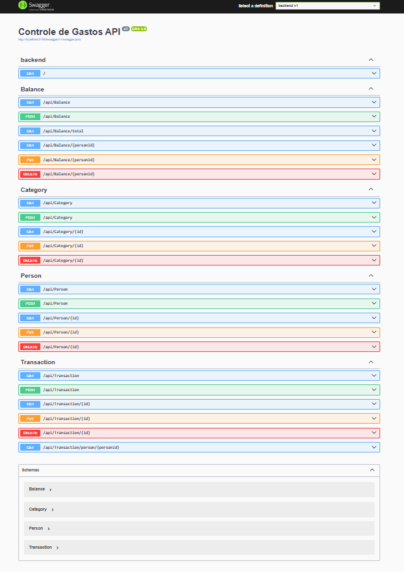
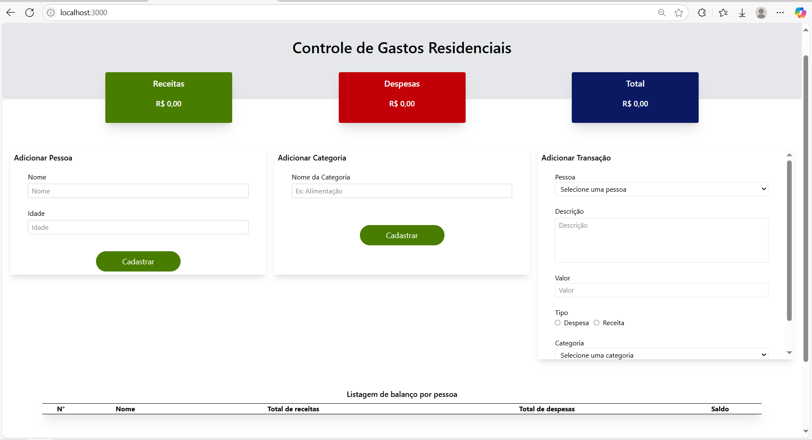

# Backend

Para o backend utilizei .NET 9.0 para construir a api e o banco de dados em memória do .NET para o armazenamento.

# Frontend

Para o frontend utilizei React com TypeScript, utilizando o Vite para a criação, além disso, também utilizei Tailwindcss para a estilização. No próprio react utilizei algumas bibliotecas para auxiliar o desenvolvimento como react-hook-form para os formulários e TanStak Query ou react-query, como é mais conhecido, para o fetching dos dados. Optei por utilizar essas tecnologias pois tenho familiaridade com elas e algumas vantagens em relação à segurança, organização, custo, agilidade no desenvolvimento e entre outras.

## Instruções para execução

### 1. Clone o repositório

```bash
git clone https://github.com/EmersonSousa15/Controle-de-gastos.git
cd Controle-de-gastos
```

### 2. Execute com Docker

```bash
docker-compose up
```

### 3. Acesse no navegador

**Frontend (React):**  http://localhost:3000/

**Backend (.NET):**  http://localhost:5190/

**Swagger (API docs):** http://localhost:5190/swagger


## Imagens do projeto em execução

**Swagger:**



**Home:**



**Demonstração:**

[Vídeo de demonstração](https://youtu.be/IvIgJpVZjhI)